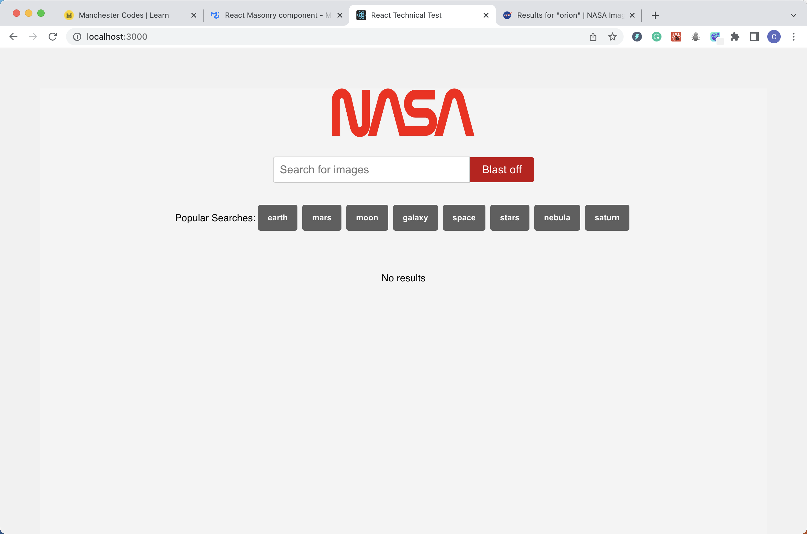
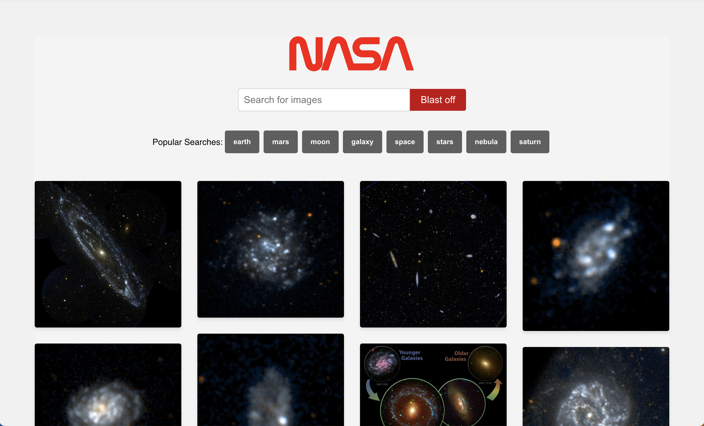
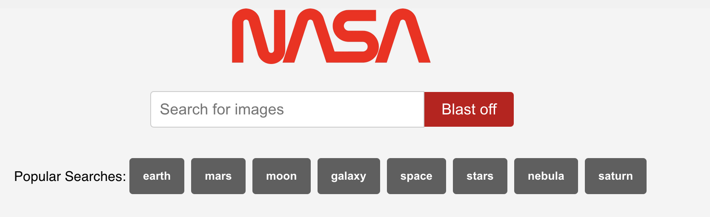

# NASA Image Search App

This project was created to demonstrate a simple image search application using the NASA Image and Video Library API.

## Task

Build and design a search page which allows users to search for images by keyword using the NASA image API.

## Features

- Search for images using the search bar
- Browse images using popular tags
- Responsive masonry-style grid layout for displaying images
- Customized design for a better user experience

## Screenshots

## Built With

- React (functional component approach)
- NASA Image and Video Library API
- Axios for API requests

## Testing Libraries

A BDD approach was taken when it came to testing the application, first building the component and implementing the required features, and then testing against the acceptance criteria.

Testing libraries include:

- Jest
- React Testing Library

## Packages Used

In addition to the testing libraries mentioned above:

- ESLint - used to follow industry standard rules with some slight configurations
- Prettier - used to ensure consistency in code formatting
- Prop Types - used to type check this React application and catch errors before runtime
- Axios - used to make requests to the NASA API endpoint

## Installation Instructions

1. Clone this repo

Git clone https://github.com/CodeChris96/react-tech-test.git

2. Change directory into the repo

cd react-tech-test

3. Install the dependencies from package-lock.json

npm install

4. To start the app:

npm start

5. To test the app:

npm test

## If I Had More Time

I would like to implement:

- Improve the "No results" behavior by only displaying it after a search has been performed.
- Write tests for the getImages request function.
- Enhance the overall design and user experience, including animations, transitions, and error handling.

## Author

This project was authored by [Chris Edwards](https://github.com/Codechris96).
